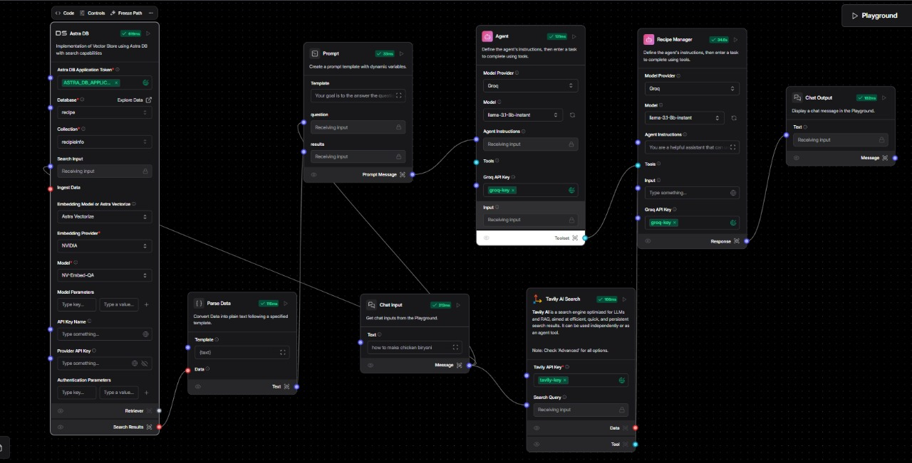
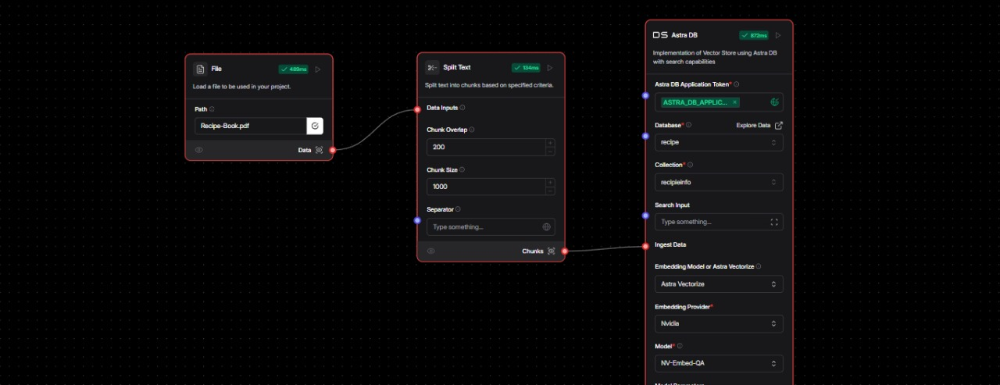
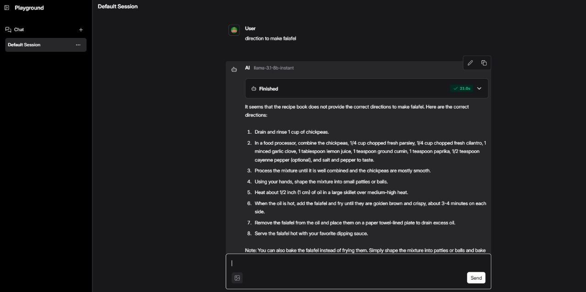
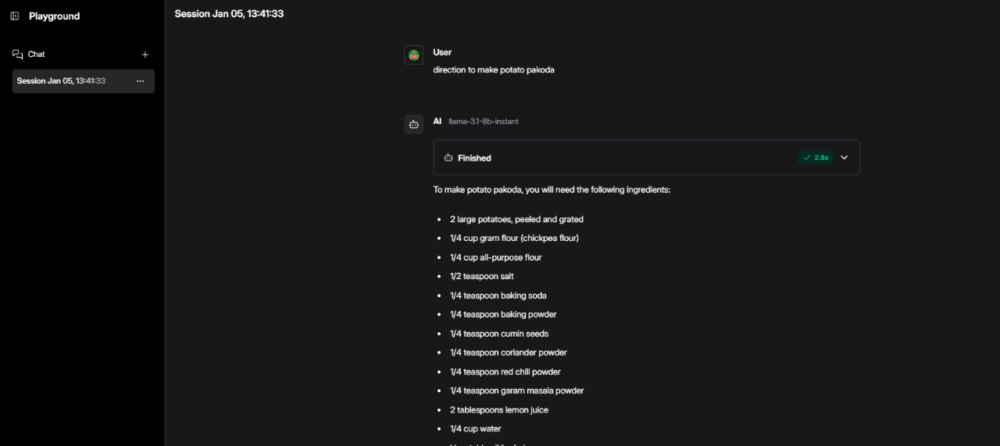

# Recipe Generator Chatbot with RAG (Retrieval-Augmented Generation)

**"AI Recipe Master: A Chatbot with RAG-Powered Recipe Retrieval"**

## Overview

This project demonstrates how to build a recipe generator chatbot using Retrieval-Augmented Generation (RAG). The chatbot can fetch recipes from a local database or perform web searches to provide users with accurate and relevant cooking instructions. This step-by-step guide uses Langflow to simplify the integration of multiple components like chat inputs, agents, and databases.

---


### **What is RAG (Retrieval-Augmented Generation)?**

Retrieval-Augmented Generation (RAG) is an advanced AI approach that combines the strengths of information retrieval systems and generative AI models. It works by retrieving relevant documents or data from a knowledge base and using them to generate precise and contextually accurate responses.

#### **How RAG Works**

1. **Input Query** : The user provides a query (e.g., "How do I make garlic bread?").
2. **Retrieval Step** : The system searches a knowledge base (e.g., a database or document store) for relevant information.
3. **Augmentation Step** : The retrieved information is provided as context to the generative AI model (like GPT) to generate an enhanced, accurate response.
4. **Response Generation** : The AI generates an answer based on the retrieved context and the user query.

#### **Advantages of RAG**

* **Accuracy** : It provides factual responses grounded in the retrieved data.
* **Efficiency** : Reduces hallucinations by anchoring responses in actual information.
* **Scalability** : Can integrate with large-scale databases, such as AstraDB, for rapid information retrieval.

---

### **AstraDB: A Cloud-Native NoSQL Database**

**AstraDB** is a fully managed database-as-a-service built on Apache Cassandra, designed for high performance, scalability, and flexibility. It’s an excellent choice for implementing the retrieval step in a RAG system.

#### **Key Features of AstraDB**

1. **Scalability** : Handles large volumes of data and high query loads efficiently.
2. **Cloud-Native** : Runs seamlessly on AWS, Google Cloud, or Microsoft Azure.
3. **APIs for Flexibility** : Supports GraphQL, REST, and gRPC APIs for easy integration with various applications.
4. **Serverless Architecture** : Scales automatically based on demand, reducing operational overhead.
5. **Free Tier** : Offers a generous free tier, making it accessible for development and testing.

---

### **Why Use AstraDB in a RAG System?**

1. **Data Storage** :

* Recipes, ingredients, steps, and metadata can be stored in structured tables.
* AstraDB's columnar data model supports efficient querying and retrieval of recipe information.

1. **Fast Retrieval** :

* AstraDB provides low-latency data access, crucial for real-time AI applications like chatbots.

1. **Integration** :

* Its REST and GraphQL APIs simplify connecting to AI workflows created in Langflow or custom Python scripts.

1. **Scalability for Large Datasets** :

* AstraDB can handle extensive recipe datasets, including millions of rows, without performance degradation.

1. **Data Synchronization** :

* Real-time updates allow the database to stay up-to-date, ensuring the chatbot fetches the latest recipes.


## Features

- **User-Friendly Interaction** : Chat-based interface for recipe queries.
- **RAG Integration** : Combines database retrieval and generative AI for robust recipe fetching.
- **Dynamic Search** : Automatically switches to web search if the recipe is not available in the local database.
- **Database Integration** : Uses AstraDB to store and retrieve recipe data efficiently.
- **Customizable Agents** : Configurable agents to handle information retrieval and processing.

---

## Prerequisites

Before starting, ensure you have the following installed:

- **Python 3.8+**
- **Langflow** : [Langflow Installation Guide](https://github.com/logspace-ai/langflow)
- **AstraDB Account** : Sign up at [AstraDB](https://www.datastax.com/astra)
- **API Access** : Gemini API or any web-search API for external information retrieval.
- **Other Libraries** : Install dependencies listed in `requirements.txt`.

---

## Setup Instructions

### 1. Clone the Repository

```bash
$ git clone https://github.com/your-username/recipe-generator-rag.git
$ cd recipe-generator-rag
```

### 2. Install Dependencies

```bash
$ pip install -r requirements.txt
```

### 3. Configure Environment Variables

Create a `.env` file in the root directory and add the following:

```env
ASTRADB_ID=<your-astradb-client-id>
ASTRADB_SECRET=<your-astradb-client-secret>
WEB_API_KEY=<your-web-search-api-key>
LANGFLOW_API_KEY=<your-langflow-api-key>
```

### 4. Setup AstraDB

- Create a database named `recipes`.
- Add a table with fields for recipe name, ingredients, and steps.

---

## Step-by-Step Workflow

### 1. Setup

- Sign up or log in to Langflow.
- Create a new project flow and name it `Recipe Generator`.

### 2. Creating Inputs/Outputs

- **Inputs** : Add a chat input node to capture user queries.
- **Outputs** : Add a text output node to display chatbot responses.

### 3. Agent Configuration

- Use Langflow to create agents.
- Connect tools for database retrieval and web search API integration.

### 4. Database Integration

- Link the chatbot to AstraDB using Langflow's database tool.
- Ensure queries to AstraDB return accurate recipe details.

### 5. Functional Testing

- Query the chatbot with example inputs like:
  - "How do I make a chocolate cake?"
  - "What's a good recipe for pasta salad?"
- Validate responses from both the database and web search.

---

## Usage

### Run the Chatbot

```bash
$ streamlit run ./main.py
```

### Example Query

**User** : "How do I make garlic bread?"

**Chatbot** : "To make garlic bread, you will need: ... [recipe details fetched from database or web]"

---

## Screenshots

### Langflow Architecture

Here is the visual representation of the Langflow workflow used to build the chatbot:

![Langflow Architecture]


### Chatbot Output

Example of chatbot interaction in the Streamlit UI:




---

## Langflow Playground

Explore the Langflow playground with a live demo:

[Langflow Playground Demo](https://astra.datastax.com/langflow/62f7f0d1-631b-449d-a892-b475e8114ed1/flow/a17833e2-2c48-4065-800e-839a451c1d2b)

---

## Acknowledgements

- **Langflow** for simplifying AI workflow management.
- **AstraDB** for robust database services.
- **OpenAI** for powering generative responses.

---

## Contributing

Pull requests are welcome. For major changes, please open an issue first to discuss what you would like to change.
